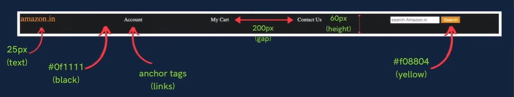

# Label 1

```
Practice set 2

Q1. Create a heading centered on the page with all of its text capitalized by default.

Q2. Set the font family of all the content in the document to "Times New Roman".

Q3. Create one div inside another div. Set id and text "outer" for the first one and "inner" for the second one. Set the outer div text size to 25px and inner div text size to 10px.
```

Solution:

### index.html

```html
<!DOCTYPE html>
<html lang="en">
<head>
    <meta charset="UTF-8">
    <meta name="viewport" content="width=device-width, initial-scale=1.0">
    <title>Document</title>
    <link rel="stylesheet" href="./style.css">
</head>
<body>
    <h1>My heading</h1>
    <div id="outer">
        This is the outer div.
        <div id="inner">
            This is the inner div.
        </div>
    </div>
</body>
</html>
```

### style.css

```css
* {
    font-family: "Times New Roman";
}

h1 {
    text-align: center;
    text-transform: uppercase;

}

#outer {
    font-size: 25px;
}

#inner {
    font-size: 10px;
}
```

# Label 2

Create the following navbar using only HTML and CSS:


Use the following design for reference:



Solution:

### index.html

```html
<!DOCTYPE html>
<html lang="en">
<head>
    <meta charset="UTF-8">
    <meta name="viewport" content="width=device-width, initial-scale=1.0">
    <title>CSS Level 2</title>
    <link rel="stylesheet" href="./style.css">
</head>
<body>
    <div id="navbar">
        <a class="navbar_item" id="logo">amazon.in</a>
        <a href="" class="navbar_item">Account</a>
        <a href="" class="navbar_item">My Cart</a>
        <a href="" class="navbar_item">Contact Us</a>
        <input type="text" placeholder="search Amazon store" class="navbar_item">
        <button class="navbar_item">Search</button>
    </div>
</body>
</html>
```

### style.css

```css
* {
    margin: 0;
    padding: 0;
}

#navbar {
    background-color: #0f1111;
    height: 60px;
}

.navbar_item {
    color: white;
}

#logo {
    color: #f08804;
    font-size: 25px;
}

a {
    margin-right: 200px;
    text-decoration: none;
}

button {
    background-color: #f08804;
}
```